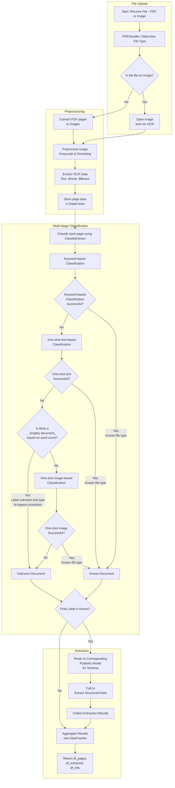

# form-sage
🤖 AI-powered Document Processor | 📄 Multi-page support | 🎯 Structured data extraction | 💡 Layout-aware intelligence

## 📄 Overview
This application allows you to upload PDFs or images of specific document types, and extract structured data from them using the Gemini 2.0 Flash API. The extracted data is displayed in a user-friendly format, and you can also view uploaded images for debugging.

## ✨ Features
- **📁 File Upload:** Upload PDF or image files for processing.
- **🔍 Data Extraction:** Extract structured data from the uploaded documents.
- **🖼️ Image and Data Comparison:** View images and extracted data side by side.
- **📊 Data Display:** Display the extracted data in a tabular format.

## 🛠️ How It Works
1. **Upload a File:** Use the file uploader in the sidebar to upload a PDF or image file.
2. **Processing:** The uploaded file is processed using the Gemini 2.0 Flash API to extract structured data.
3. **Display Results:** The extracted data is displayed in two columns: one for the output data and one for the image of the page.

## 📋 Usage
1. **Upload a File:**
    - Click on the "Upload a PDF or Image" button in the sidebar.
    - Select a PDF or image file from your computer.
2. **View Results:**
    - The extracted data will be displayed in the main area.
    - Use the page navigation in the sidebar to select different pages.

## 📈 Flow Chart
Here is a flowchart depicting how this all works:


## 🧑‍💻 Technical Details
- **🔧 Backend:** The backend processing is handled by the `fast_processor_gemini.py` script.
- **📚 Libraries Used:**
    - `streamlit` for the web interface.
    - `pandas` for data manipulation.
    - `Pillow` for image processing.
    - `google-genai` for interacting with the Gemini 2.0 Flash API.
    - `paddleocr` for OCR processing.
    - `transformers` for text and image classification.
- **🤖 One-Shot Models Used:**
    - `facebook/bart-large-mnli` for text-based zero-shot classification.
    - `openai/clip-vit-base-patch32` for image-based zero-shot classification.
- **💾 Database:**
    - The application uses SQLite for storing extracted data and processing results.


```pandas rapidfuzz paddlepaddle-gpu paddleocr numpy transformers```
```pip install paddlepaddle-gpu==3.0.0b1 -i https://www.paddlepaddle.org.cn/packages/stable/cu123/```
```pip install torch torchvision torchaudio --index-url https://download.pytorch.org/whl/cu124```
```pip install torch==2.2.1 torchvision==0.17.1 torchaudio==2.2.1 --index-url https://download.pytorch.org/whl/cu121```

```python -m pip install paddlepaddle-gpu==2.6.1.post120 -f https://www.paddlepaddle.org.cn/whl/windows/mkl/avx/stable.html```